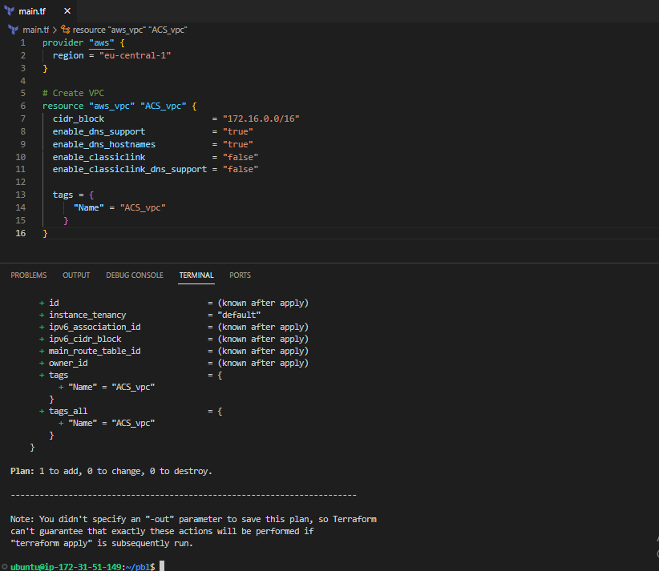
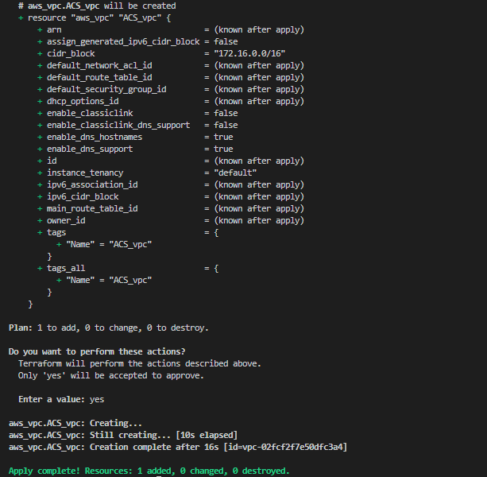
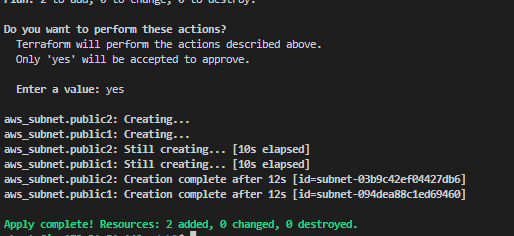
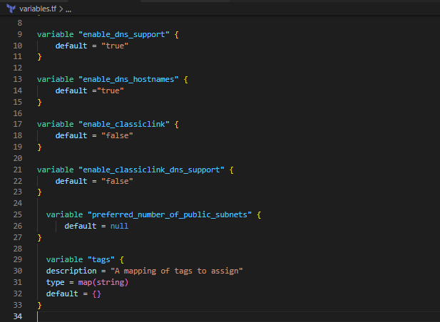
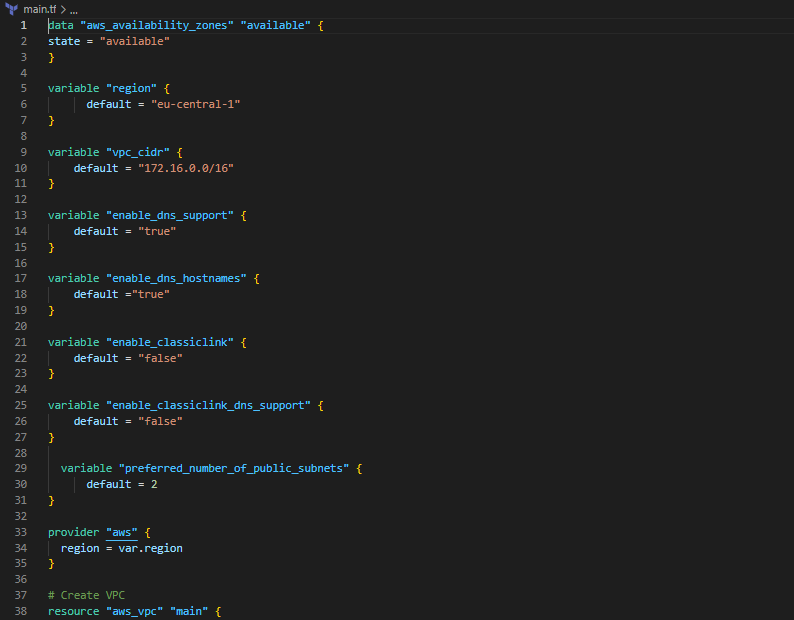
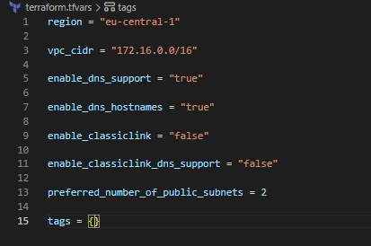
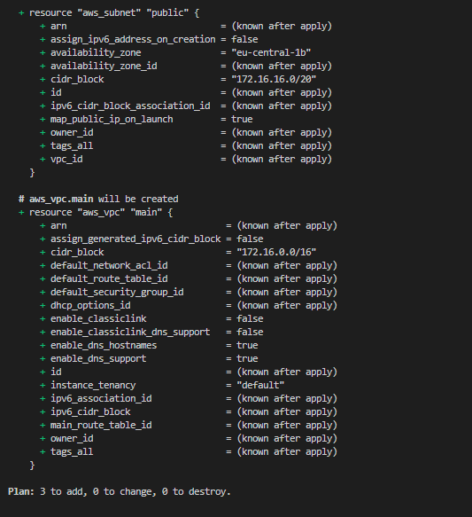
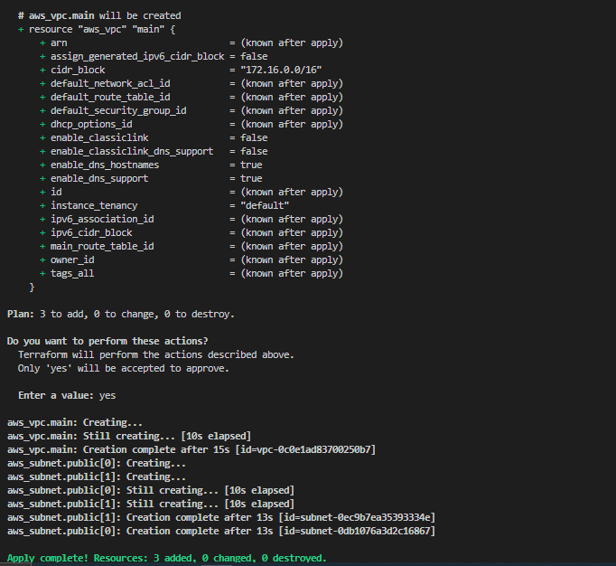

   #  **DOCUMENTATION OF PROJECT 16**
## **AUTOMATE INFRASTRUCTURE WITH IAC USING TERRAFORM.**


**Step 1**

We set up our machine and install the appropriate softwares. After we have built AWS infrastructure for 2 websites manually, it is time to automate the process using Terraform.

Now lets create a directory structure inside Virtual studio code and name it pbl. Create a file in the folder, name it main.tf

```
provider "aws" {
  region = "eu-central-1"
}

# Create VPC
resource "aws_vpc" "main" {
  cidr_block                     = "172.16.0.0/16"
  enable_dns_support             = "true"
  enable_dns_hostnames           = "true"
  enable_classiclink             = "false"
  enable_classiclink_dns_support = "false"
}

```

Input the code above into the main.tf file, make changes where necessary. Now we run the command `terraform init` this initializes terraform and its installs the plugins needed.

Moving on, let us create the only resource we just defined. `aws_vpc`. Use the command `terraform plan` to see what terraform intends to create. Now to create the resource we run `terraform apply`






The above images shows us creating the first resource which is `aws_vpc`

According to our architectural design, we require 6 subnets but we will be creating 2 public subnet for now.

```
# Create public subnets1
    resource "aws_subnet" "public1" {
    vpc_id                     = aws_vpc.main.id
    cidr_block                 = "172.16.0.0/24"
    map_public_ip_on_launch    = true
    availability_zone          = "eu-central-1a"

}

# Create public subnet2
    resource "aws_subnet" "public2" {
    vpc_id                     = aws_vpc.main.id
    cidr_block                 = "172.16.1.0/24"
    map_public_ip_on_launch    = true
    availability_zone          = "eu-central-1b"
}
```
Adding the above configuration to the main.tf file

Run `terraform plan` and `terraform apply` to create the two subnets.



Above image shows us creating the public subnet

Now let us improve our code by refactoring it. First, destroy the current infrastructure using the command `terraform destroy`

We will introduce variables, and remove hard coding below is the image of the `variable.tf` file





```
# Get list of availability zones
data "aws_availability_zones" "available" {
state = "available"
}

variable "region" {
      default = "eu-central-1"
}

variable "vpc_cidr" {
    default = "172.16.0.0/16"
}

variable "enable_dns_support" {
    default = "true"
}

variable "enable_dns_hostnames" {
    default ="true" 
}

variable "enable_classiclink" {
    default = "false"
}

variable "enable_classiclink_dns_support" {
    default = "false"
}

  variable "preferred_number_of_public_subnets" {
      default = 2
}

provider "aws" {
  region = var.region
}

# Create VPC
resource "aws_vpc" "main" {
  cidr_block                     = var.vpc_cidr
  enable_dns_support             = var.enable_dns_support 
  enable_dns_hostnames           = var.enable_dns_support
  enable_classiclink             = var.enable_classiclink
  enable_classiclink_dns_support = var.enable_classiclink

}

# Create public subnets
resource "aws_subnet" "public" {
  count  = var.preferred_number_of_public_subnets == null ? length(data.aws_availability_zones.available.names) : var.preferred_number_of_public_subnets   
  vpc_id = aws_vpc.main.id
  cidr_block              = cidrsubnet(var.vpc_cidr, 4 , count.index)
  map_public_ip_on_launch = true
  availability_zone       = data.aws_availability_zones.available.names[count.index]

}
```
the above code should be the way our main.tf file looks

Now we will put all variable declarations in a separate file
And provide non default values to each of them.

Create a new file and name it variables.tf.
Copy all the variable declarations into the new file.
Create another file, name it terraform.tfvars.
Set values for each of the variables.




Above images show the `variable.tf` file and `terraform.tfvars` file.

Run `terraform plan` and `terraform apply` and ensure everything works.





The above image shows that our configuration is succesful

## END OF PROJECT 16